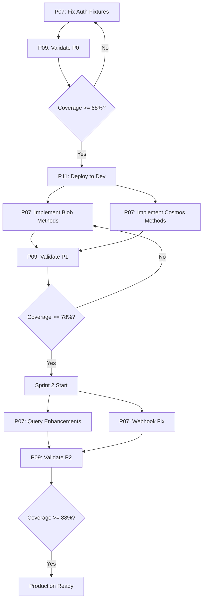

# Sprint Coordination Plan - Test Coverage Improvement

**Sprint**: Test Coverage Improvement Sprint 1-2
**Goal**: Increase eva-api test coverage to 80%+ and deploy to dev
**SM**: Scrum Master (AI Steward)
**Duration**: 2 weeks per sprint (4 weeks total)
**Status**: Planning

---

## Sprint Overview

### Sprint 1 (Weeks 1-2): Quick Wins + Service Implementation
- **Goal**: Fix test infrastructure and implement Blob/Cosmos methods
- **Target Coverage**: 78% (from 52.92%)
- **Stories**: STORY-001, STORY-002, STORY-003
- **Points**: 29 points
- **Key Milestone**: Deploy to dev environment

### Sprint 2 (Weeks 3-4): Enhancements + Stability
- **Goal**: Add query enhancements and fix architectural issues
- **Target Coverage**: 88%
- **Stories**: STORY-004, STORY-005, STORY-006
- **Points**: 21 points
- **Key Milestone**: Production-ready quality

---

## Agent Assignments

| Agent | Sprint 1 Tasks | Sprint 1 Points | Sprint 2 Tasks | Sprint 2 Points |
|-------|----------------|-----------------|----------------|-----------------|
| **P07** | P0-1 to P0-5, P1-1 to P1-9 | 17h | P2-1 to P2-6 | 13h |
| **P09** | P0-1 to P0-3, P1-1 to P1-4 | 13.5h | P2-1 to P2-3 | 8h |
| **P11** | P0-1 to P0-3, P1-1 to P1-3 | 12h | Monitoring/Support | 4h |
| **P02** | Epic management, story refinement | 4h | Story updates | 2h |

**Total Team Capacity**: 46.5h (Sprint 1), 27h (Sprint 2)

---

## Dependencies Map



---

## Daily Coordination

**Daily Standup**: 10:00 AM (15 minutes)
- **Format**: Async via GitHub Discussion
- **Questions**:
  1. What did you complete yesterday?
  2. What are you working on today?
  3. Any blockers or dependencies?

**Status Updates**: End of each day
- P07: Coverage delta report
- P09: Validation status
- P11: Deployment/monitoring status

**Blocker Resolution**: Within 4 hours
- SM facilitates resolution
- Escalate to PO if >24h unresolved

---

## Communication Plan

**Urgent Issues** (P0):
- Post in #eva-api-urgent channel
- Tag @SM immediately
- SM responds within 1 hour

**Progress Reports**:
- Daily: Brief updates in standup
- Weekly: Comprehensive report to PO
- Milestone: Demo to stakeholders

**Decision Points** (require PO approval):
- [ ] Deploy now (Option A) vs wait for higher coverage
- [ ] Sprint 1 scope changes
- [ ] Sprint 2 scope changes
- [ ] Production promotion criteria

---

## Risk Register

| Risk | Probability | Impact | Mitigation | Owner |
|------|-------------|--------|------------|-------|
| P07 capacity insufficient | Medium | High | Prioritize P0 tasks, defer P2 if needed | SM |
| Implementation introduces bugs | Medium | High | TDD approach, P09 validation gates | P07/P09 |
| Deployment issues | Low | High | Thorough testing, rollback plan ready | P11 |
| Coverage target not met | Low | Medium | Focus on quality over quantity | SM/P09 |
| Azure service costs spike | Low | Medium | Monitor usage, set budget alerts | P11 |
| Test flakiness | Medium | Medium | Fix immediately, don't skip | P07 |

---

## Success Metrics

**Sprint 1 Success Criteria**:
- [ ] Coverage >= 78% (stretch: 80%)
- [ ] All P0 and P1 stories complete
- [ ] Deployed to dev environment
- [ ] Zero P0 bugs in backlog
- [ ] P09 sign-off on quality gates

**Sprint 2 Success Criteria**:
- [ ] Coverage >= 88% (stretch: 90%)
- [ ] All P2 stories complete
- [ ] Integration tests passing
- [ ] Production deployment approved
- [ ] Documentation complete

---

## Sprint 1 Detailed Plan

### Week 1
**Monday-Tuesday**: P07 P0 tasks (4h)
- Fix authentication fixtures
- Fix config/import errors
- Target: 68% coverage by Tuesday EOD

**Wednesday**: P09 validation + P11 deployment prep (4h)
- P09 validates P0 completion
- P11 prepares App Service
- Decision: Deploy to dev?

**Thursday-Friday**: P07 P1 tasks start (10h)
- Implement Blob Storage methods
- Start Cosmos DB methods

### Week 2
**Monday-Wednesday**: P07 P1 tasks continue (14h)
- Complete Cosmos DB methods
- Implement query lifecycle

**Thursday**: P09 validation (3h)
- Validate P1 completion
- Target: 78% coverage achieved

**Friday**: Sprint review + Sprint 2 planning (4h)
- Demo to PO (Marco)
- Retrospective
- Plan Sprint 2

---

## Sprint 2 Detailed Plan

### Week 3
**Monday-Tuesday**: P07 P2 tasks (Query + Webhook) (8h)
- Token estimation
- Retry logic
- Webhook refactoring

**Wednesday-Thursday**: P07 integration tests (8h)
- Set up integration environment
- Fix blob/GraphQL integration tests

**Friday**: Buffer/refinement (4h)

### Week 4
**Monday-Tuesday**: P09 validation + exploratory testing (8h)
- Validate all P2 tasks
- Exploratory testing sessions

**Wednesday**: Final validation (4h)
- P09 comprehensive validation
- Coverage report finalization

**Thursday**: Sprint review + production planning (4h)
- Demo to stakeholders
- Plan production promotion

**Friday**: Documentation + handoff (4h)
- Complete all documentation
- Handoff to operations team

---

## Ceremonies

**Sprint Planning**: 4 hours (completed - this document)
- Epic breakdown complete
- Stories estimated
- Tasks assigned

**Daily Standup**: 15 minutes daily
- Progress check
- Blocker identification
- Coordination

**Sprint Review**: 2 hours (end of each sprint)
- Demo to PO
- Coverage progress review
- Stakeholder feedback

**Sprint Retrospective**: 1 hour (end of each sprint)
- What went well?
- What needs improvement?
- Action items for next sprint

**Backlog Refinement**: 1 hour mid-sprint
- Refine Sprint 2 stories
- Adjust estimates if needed

---

## Workspace Setup

**Repositories**:
- `eva-api` (primary work)
- `eva-orchestrator` (documentation reference)

**Branches**:
- `main` (protected)
- `feature/test-coverage-quick-wins` (STORY-001)
- `feature/blob-service-methods` (STORY-002)
- `feature/cosmos-service-methods` (STORY-003)
- `feature/query-enhancements` (STORY-004)
- `feature/webhook-refactor` (STORY-005)
- `feature/integration-tests` (STORY-006)

**Pull Request Strategy**:
- One PR per story
- P07 creates PR
- P09 reviews and approves
- SM merges after approval

---

## Monitoring & Reporting

**Daily Metrics**:
- Coverage percentage
- Tests passing/failing
- PR status
- Blocker count

**Weekly Report Format**:
```markdown
## Sprint X - Week Y Report

**Coverage**: 78.2% (was 68.1%, +10.1%)
**Stories Complete**: 2/3
**On Track**: ✅ Yes

**Completed**:
- STORY-001: Quick Wins ✅
- STORY-002: Blob Methods ✅

**In Progress**:
- STORY-003: Cosmos Methods (80% complete)

**Blockers**: None

**Next Week**:
- Complete STORY-003
- Start Sprint 2 planning
```

---

**SM Status**: 📋 Coordination plan ready
**Next Action**: Kickoff meeting with all agents
**Key Success Factor**: Daily communication and blocker resolution
