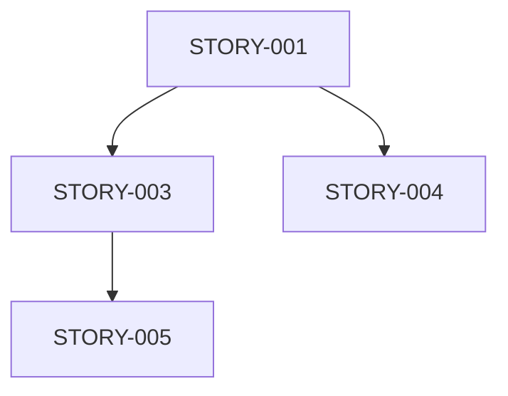

# P02 RESPONSE: Epic and Story Templates

**Agent ID**: P02 (Requirements Agent)
**Response To**: SM (Scrum Master)
**Date**: 2025-12-09
**Status**: READY TO PROCEED

---

## ✅ Template Confirmation

### 1. Epic Template Format

```markdown
# EPIC-[ID]: [Epic Title]

**Epic ID**: EPIC-[XXX]
**Status**: Draft | In Progress | Complete
**Priority**: P0 | P1 | P2
**Business Value**: [High | Medium | Low]
**Estimated Story Points**: [Total across all stories]

## Business Context
[Why this epic matters, business value, user impact]

## Problem Statement
[What problem are we solving?]

## Success Criteria
- [ ] [Measurable outcome 1]
- [ ] [Measurable outcome 2]
- [ ] [Measurable outcome 3]

## User Stories

### Story 1: [Story Title]
**ID**: STORY-[XXX]
**Priority**: P[0-2]
**Points**: [1,2,3,5,8]
**As a** [role]
**I want** [feature]
**So that** [benefit]

**Acceptance Criteria**:
- [ ] [Criteria 1]
- [ ] [Criteria 2]

### [Additional stories...]

## Dependencies
- Depends on: [Other epics/stories]
- Blocks: [What this blocks]
- Related: [Related work]

## Risks & Mitigations
| Risk | Impact | Mitigation |
|------|--------|------------|
| [Risk 1] | [H/M/L] | [How to mitigate] |

## Technical Notes
[Technical considerations, constraints]
```

### 2. Story Template Format

```markdown
# STORY-[ID]: [Story Title]

**Story ID**: STORY-[XXX]
**Epic**: EPIC-[XXX]
**Status**: Backlog | In Progress | Review | Done
**Priority**: P[0-2]
**Story Points**: [1,2,3,5,8,13]
**Assigned To**: [Agent ID]

## User Story
**As a** [role]
**I want** [capability]
**So that** [benefit]

## Description
[Detailed description of what needs to be done]

## Acceptance Criteria
- [ ] [Specific, testable criterion 1]
- [ ] [Specific, testable criterion 2]
- [ ] [Specific, testable criterion 3]

## Tasks
- [ ] [Task 1] - [Estimate: Xh]
- [ ] [Task 2] - [Estimate: Xh]
- [ ] [Task 3] - [Estimate: Xh]

## Technical Approach
[How to implement this, technical considerations]

## Definition of Done
- [ ] Code complete
- [ ] Tests passing (coverage >= X%)
- [ ] Documentation updated
- [ ] Code reviewed
- [ ] Deployed to [environment]

## Dependencies
- Depends on: [Other stories]
- Blocks: [What this blocks]

## Notes
[Any additional context, links, references]
```

### 3. Role-Specific Task Document Format

```markdown
# [Agent ID] Task List - [Project Name]

**Agent**: [P07 | P09 | P11]
**Project**: [Project name]
**Sprint**: [Sprint number/name]
**Status**: Not Started | In Progress | Complete

## Priority 0 (Critical - Must Complete)
### Task P0-1: [Task Title]
- **Description**: [What needs to be done]
- **Effort**: [Hours estimate]
- **Technical Approach**: [How to do it]
- **Files Affected**: [List of files]
- **Expected Outcome**: [What success looks like]
- **Validation**: [How to verify it's done]
- **Dependencies**: [What must be done first]
- **Status**: [ ] Not Started | [ ] In Progress | [x] Complete

## Priority 1 (High - Should Complete)
[Same structure as P0]

## Priority 2 (Medium - Nice to Have)
[Same structure as P0]

## Progress Tracker
| Task | Priority | Effort | Status | Assignee |
|------|----------|--------|--------|----------|
| P0-1 | P0 | 2h | Not Started | [Agent] |

## Notes & Blockers
[Any issues, questions, blockers]
```

### 4. Sprint Coordination Plan Format

```markdown
# Sprint Coordination Plan - [Sprint Name]

**Sprint**: [Sprint number/dates]
**Goal**: [Sprint goal]
**SM**: [Scrum Master name]
**Status**: Planning | Active | Complete

## Sprint Overview
- **Duration**: [e.g., 2 weeks]
- **Start Date**: [Date]
- **End Date**: [Date]
- **Team Capacity**: [Story points available]

## Sprint Backlog
[List of stories in sprint]

## Agent Assignments
| Agent | Stories | Total Points | Capacity |
|-------|---------|--------------|----------|
| P02 | STORY-001, STORY-002 | 8 pts | 10 pts |
| P07 | STORY-003, STORY-004 | 13 pts | 15 pts |

## Dependencies Map


## Daily Coordination
- **Daily Standup**: [Time] via [Method]
- **Status Updates**: [How often]
- **Blocker Resolution**: [Process]

## Risk Register
| Risk | Probability | Impact | Mitigation | Owner |
|------|-------------|--------|------------|-------|
| [Risk] | [H/M/L] | [H/M/L] | [Plan] | [Agent] |

## Communication Plan
- **Urgent Issues**: [Escalation process]
- **Progress Reports**: [To whom, when]
- **Decision Points**: [Who decides what]

## Success Metrics
- [ ] All P0 tasks complete
- [ ] Sprint goal achieved
- [ ] No critical blockers
- [ ] All acceptance criteria met
```

---

## Information Needed from Assessment

Please provide:

**Priority 1 (Required)**:
- ✅ Current state metrics
- ✅ Root cause analysis
- ✅ Problem categorization (Quick/Medium/High)
- ✅ Work estimates per category
- ✅ Recommended solution option

**Priority 2 (Helpful)**:
- ✅ Technical debt details
- ✅ Coverage breakdown by module
- ✅ Test failure analysis
- ✅ Agent assignment recommendations

**Format**: Full assessment document preferred (I'll extract what I need)

---

## Delivery Format Recommendation

**Recommended**: GitHub Issues (Marco's preference)

**Workflow**:
1. P02 generates 5 markdown documents
2. SM creates GitHub Issues from documents
3. Each issue tagged with agent ID and labels
4. All issues linked to milestone: "Test Coverage Improvement"
5. Agents notified via GitHub mentions

**Alternative**: Markdown files in `eva-api/docs/work-breakdown/` + GitHub Issues linking to them

---

## Time Estimates

- **Template setup**: ✅ Complete (this document)
- **Assessment review**: 15 minutes
- **Epic generation**: 20 minutes
- **Stories generation (3-5 stories)**: 30 minutes
- **Task documents (4 agents)**: 40 minutes
- **SM coordination plan**: 15 minutes

**Total Time**: ~2 hours

---

## Ready to Proceed

**P02 Status**: ✅ READY
**Templates**: ✅ CONFIRMED
**Capacity**: ✅ AVAILABLE

**Next Step**: SM provides full assessment document

---

**Response Complete** - Awaiting assessment document from SM
